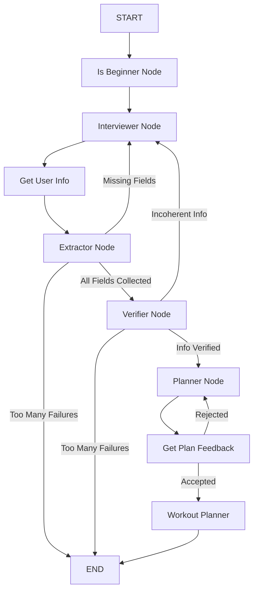

# RunGraph: AI Running Coach

A personalized running coach powered by LLMs and LangGraph. This agent interviews you to understand your fitness level, goals, and constraints, and then generates a tailored training plan.

## Key Concepts
This project demonstrates the following agentic concepts:
- **Agent powered by LLM**: Uses OpenAI's GPT-4o-mini to reason and interact with the user.
- **State Management & Persistence**: Utilizes `LangGraph` with SQLite checkpoints to manage conversation state and persist user sessions across multiple turns.
- **Structured Output**: Extracts specific data points (age, goal, injury history, etc.) into Pydantic models to ensure data validity.
- **Observability**: Integrated with **LangSmith** for full tracing and debugging of agent workflows.
- **Multi-step Workflow**: Implements a directed graph to guide the user through a logical flow.

## Architecture
The agent is built as a state machine using `LangGraph`.



### Node Responsibilities
1.  **Is Beginner Node**: Determines if the user is a beginner or advanced runner.
2.  **Interviewer Node**: Asks follow-up questions to gather missing information.
3.  **Extractor Node**: Parses the user's natural language responses into structured data.
4.  **Verifier Node**: Checks the collected data for coherence and completeness.
5.  **Planner Node**: Generates a high-level training plan based on the verified profile.
6.  **Workout Planner**: Generates specific workout sessions.

## Challenges & Learnings
- **Structured Data vs. Natural Conversation**: I think an ad-hoc UIs is more efficient for gathering data. Wrangling an agent to naturally extract information without hallucinating could open up new interaction models (e.g., email-based profiling).
- **Role Specialization**: I chose to define nodes with very specific responsibilities (e.g., one node just for extraction, another for verification). I'd be curious to make a comparison with a monolithic agent and see if the specialized nodes are more robust.
- **Validation Loops**: Implementing loops where the agent retries upon failure (e.g., missing fields or incoherent data) is crucial for reliability. Given that LLMs also are paid by usage, it's also important to create exit condition when the user is not cooperating.

## Features I would've liked to implement (and might get to in the future)
- **Asynchronous Feedback**: Proactively reaching out to the user to ask for feedback after a scheduled run.
- **Weekly Reviews**: A reminder system to review the weekly plan on a specific day.
- **Calendar Integration**: Integration with Google Calendar to automatically schedule workouts.
- **Wearable Integration**: Integration with platforms like Garmin Connect (potentially via APIs or tools) to download workout data, create structured workouts, and upload them directly to the user's watch.

## Installation

### Prerequisites
- Python 3.12 or higher
- An OpenAI API Key
- (Optional) LangSmith API Key for tracing

### Setup

1.  **Clone the repository:**
    ```bash
    git clone <repository_url>
    cd agents_capstone
    ```

2.  **Install dependencies:**
    This project uses `uv` for dependency management, but you can also use standard `pip`.

    **Using `uv` (Recommended):**
    ```bash
    uv sync
    ```

    **Using `pip`:**
    ```bash
    (optional but recommended: create a virtual environment)
    python -m venv .venv
    source .venv/bin/activate
    pip install .
    ```

3.  **Configure Environment:**
    Copy the example environment file and add your API keys.
    ```bash
    cp .env.example .env
    ```
    Open `.env` and set your `OPENAI_API_KEY`. If using LangSmith, set also `LANGCHAIN_API_KEY` and the other relevant variables.

## Usage

To start the coaching session, run the agent script:

```bash
uv run agent.py # or python agent.py
```

The agent will start by asking you about your running experience. Answer the questions naturally. The agent will persist until it has enough information to create a plan for you.